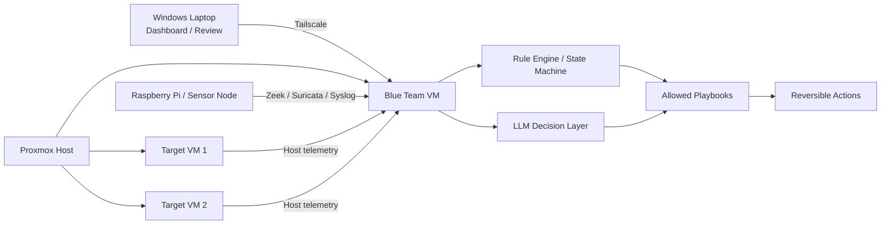

Saturday 
    Maintanence, Patch Updates, admin tasks for the network
    
Sunday 
    Quiet time in the network, general background telemetry and SYN/ACK like convos. 

Monday - Friday
    Business between 0900-1700(ish), with plenty of user simulation activity

So from saturday to sunday, we have a lot of maintenance and admin tasks to do. This includes patch updates and general upkeep of the network. Monday through friday we should be emulating business activity and behavior, with randomness and some user simulation.

Ideas for Simulation:

- Multi Web Server Hosting Datacenter (lines up with most vulnhub machines)
    We already have this set up with mercury/mrrobot/earth/csec. We can add more machines to this, such as a mail server, a database server, and a DNS server. This would allow for a variety of attack vectors and scenarios, such as SQL injection, cross-site scripting, and email phishing.

- Simulate a small business network with a few workstations, a file server, and a web server. This would allow for a variety of attack vectors and scenarios, such as phishing emails, ransomware attacks, and insider threats. We could always add more machines to this, such as a printer, a VoIP phone system, and a backup server. This would allow for even more attack vectors and scenarios, such as printer vulnerabilities, VoIP attacks, and backup data breaches. 

- Simulate a home network with a few devices, such as a laptop, a smartphone, and a smart home device. This would allow for scenarios such as IoT device vulnerabilities, social engineering attacks, and password cracking.

- Simulate a public Wi-Fi network, such as a coffee shop or airport. This would allow for scenarios such as man-in-the-middle attacks, rogue access points, and data interception.

# The Cast

Here outlined is my current architectual plans for an in house purple team lab inside of proxmox.

## Simple Kali Minimal-Install for Vulnhub Intake

a itty bitty install for simple enumeration on a seperate net for new boxes i download.

## Kali

my main hacking enviro. it just works.

## Black-Arch

custom spinnable and configurablw vm for extra red hat  automation on the network, or persistence/reverse pen test.

## Ubuntu Server

grounded ollama and telemetery (with regex) blue team ai responding to IoCs

## Pf Sense Router

custom router instance to isolate the subnet, and python/bash scripting to simulate net traffic.
cron jobs for network rhythms and holidays included

## Qubes?

Digital forensics, and IoC analysis. Still unsure i even need it but hey, could be fun if blackarch goes off.

im pretty sure the backbone scripting will just be bash/py (Jokes on me so many times over, it has a REST api that just...makes shit so easy)

### Reiteration

This is bullshit and a half this doesn't exist even paid. On the other hand i'm learning so much shit boy howdy.

# Blue Team AI Opponent - Realistic Project Plan

> **Goal**: Build a believable autonomous **simulated blue-team opponent** for a Proxmox lab. The system should observe, investigate, score risk, and take only **bounded, reversible** defensive actions against designated lab VMs.

## What This Project Is

This is **not** a magic "AI SOC analyst" and it is **not** a free-form autonomous defender with root everywhere.

This project is a **stateful automation loop**:

1. Collect telemetry from the lab
2. Normalize events into a common schema
3. Maintain per-host incident state
4. Score suspicious behavior
5. Select from a small allowlist of defensive playbooks
6. Record why each action was chosen
7. Measure whether the action helped

The LLM is a **decision aid**, not the control plane.

## Core Design Principles

- **Lab only**: restricted to explicitly designated VMs and VLANs
- **Bounded autonomy**: the AI may only choose from preapproved actions
- **Reversible actions first**: snapshot, isolate, raise logging, suspend, alert
- **Evidence before action**: detect -> enrich -> correlate -> score -> act
- **No unrestricted shell**: do not let the model invent commands
- **No direct Proxmox admin authority by default**
- **Human-readable audit trail** for every recommendation and action

## What "Autonomous Opponent" Means Here

The opponent should feel active because it:

- notices scanning, persistence, staging, and egress patterns
- changes its posture over time
- reacts to attack chains instead of single events
- forces the attacker to adapt

The opponent should **not**:

- delete files on its own
- make irreversible host changes by default
- disable core lab infrastructure
- roam outside the scoped lab environment

## Recommended Architecture

## Recommended Stack

| Role | Preferred tools | Why |
|---|---|---|
| Host + log telemetry | **Wazuh** or **Security Onion** | Mature detections and centralized visibility |
| Network telemetry | **Zeek** + **Suricata** | Good protocol visibility and alerting |
| Forensic collection | **Velociraptor** | Strong artifact collection and triage workflows |
| Orchestration / playbooks | **Shuffle** or **TheHive + Cortex** | Bounded response automation |
| Detection content | **Sigma**, **ATT&CK**, **Atomic Red Team** | Structured rule and behavior coverage |
| LLM runtime | **Ollama** | Local inference for summarization and playbook choice |
| Training / simulation | **CybORG** or **CyberBattleSim** | Good for evaluation, not turnkey defense |

## Where PurPaaS Fits

PurPaaS can still be explored as a **UI or orchestration experiment**, but it should not be treated as the whole solution.

If used, it should sit **above** the telemetry and playbook layers, not replace them.

## Why Not "Just Build an Autonomous RADIUS Instance"

RADIUS is an **auth and policy surface**, not a defender by itself.

It can help if later you want identity-aware reactions such as:

- forcing reauthentication for a test account
- applying tighter network policy to a scoped lab segment
- adding friction after suspicious access patterns

But RADIUS alone will not:

- investigate incidents
- correlate host and network evidence
- build timelines
- detect staging and exfiltration chains
- feel like a blue-team opponent

Treat RADIUS as an optional **control point**, not the main brain.

## Opponent Control Loop

Run the AI in short cycles:

1. Pull fresh events from host and network sensors
2. Update the world model for each lab asset
3. Detect obvious patterns with rules
4. Score anomalies against host/user baselines
5. Ask the LLM to choose among allowed playbooks
6. Execute at most one bounded action per cycle
7. Record rationale, confidence, and effect

## Allowed Actions for Phase 1-2

The AI should only choose from a fixed catalog:

- raise log verbosity on a scoped host
- trigger Velociraptor collection
- tag a host as suspect
- capture a VM snapshot
- isolate one target VM from a lab VLAN
- block one outbound destination for one host
- suspend one suspicious process on a lab VM
- disable one **lab-only** test account

Every action should be:

- reversible
- scoped
- logged
- cooldown-limited

## Things the AI Must Not Be Allowed to Do

- free-form shell execution
- direct writes to arbitrary Proxmox configuration
- changes to the Proxmox management plane
- unrestricted firewall edits
- deletion of forensic artifacts
- broad account lockouts across the tailnet

## Detection Priorities

Prioritize behaviors that make a lab opponent feel smart:

1. **Recon**: scan bursts, rare connection patterns, unusual service touching
2. **Execution**: suspicious parent/child chains, interpreter-heavy launches, temp-path execution
3. **Persistence**: cron, systemd, startup modifications, new services
4. **Privilege changes**: sudo/su patterns, token abuse indicators, role boundary crossing
5. **Collection and staging**: large read bursts, archive creation, temp staging
6. **Exfiltration**: rare destinations, unusual egress volume, chunked/beaconed transfers
7. **Lateral movement**: cross-host auth anomalies, SMB/WinRM/SSH spread patterns

## Suggested Build Phases

### Phase 1 - Telemetry and Visibility

Deliverables:

- Blue Team VM online
- Wazuh or Security Onion collecting from target VMs
- Zeek and/or Suricata feeding network telemetry
- Dashboard showing alerts, timelines, and affected hosts

Exit criteria:

- a known test event appears in the dashboard with source host and timestamp

### Phase 2 - Stateful Incident Engine

Deliverables:

- normalized event schema
- per-host incident state
- simple confidence scoring
- ATT&CK-style behavior tags

Exit criteria:

- the system groups related events into one incident instead of isolated alerts

### Phase 3 - LLM-Guided Playbook Selection

Deliverables:

- local Ollama model
- prompt templates that consume structured telemetry only
- playbook chooser limited to approved actions
- rationale output for each decision

Exit criteria:

- given the same event bundle, the AI consistently selects from the allowlist and explains why

### Phase 4 - Autonomous Reversible Actions

Deliverables:

- snapshot integration for designated lab VMs
- one-host network isolation action
- one-host outbound block action
- one-host artifact collection action

Exit criteria:

- actions execute only within scope and can be rolled back cleanly

### Phase 5 - Evaluation and Tuning

Deliverables:

- replay of saved attack sessions
- false-positive notes
- action effectiveness scorecard
- threshold and playbook tuning

Exit criteria:

- the opponent creates pressure without constant self-sabotage

## Initial Implementation Order

Build in this order:

1. **Telemetry stack first**
2. **Detection and state tracking second**
3. **Playbook framework third**
4. **LLM decision layer fourth**
5. **Autonomous containment last**

Do **not** start with free-form AI actions.

## Minimum Viable Opponent

If time or complexity becomes a problem, the MVP should be:

- Wazuh or Security Onion for visibility
- Velociraptor for collection
- Shuffle for playbooks
- Ollama only for summarization and choosing among 5-10 actions
- Proxmox integration limited to snapshot and lab-VM isolation

That is enough to feel like an opponent without pretending the model can safely run the whole environment.

## Success Criteria

This project is successful if the blue team AI can:

- detect suspicious activity fast enough to change attacker behavior
- connect weak signals into one incident narrative
- collect useful evidence automatically
- choose from a bounded action menu
- avoid wrecking the lab with false positives

## Current Decision

**Do not make RADIUS the main project.**

Proceed with a **telemetry + SOAR + DFIR + local LLM** design:

- **Telemetry**: Wazuh or Security Onion, plus Zeek/Suricata
- **DFIR**: Velociraptor
- **Playbooks**: Shuffle or TheHive/Cortex
- **LLM**: Ollama for summarization and playbook choice
- **Optional research/simulation**: CybORG or CyberBattleSim

## Immediate Next Steps

1. Stand up a dedicated Blue Team VM on Proxmox
2. Pick **Wazuh** or **Security Onion** as the first anchor platform
3. Add one target VM and one network sensor
4. Prove telemetry ingestion before adding any AI layer
5. Define the first 5 reversible actions
6. Add the LLM only after the playbook boundaries exist

## Notes to Future Me

- The hard part is not "making AI smart enough"
- The hard part is **safe autonomy, event correlation, and scoped control**
- A realistic opponent is built from **good plumbing and tight boundaries**, not from giving a model too much power
- Start small and iterate, don't try to build the whole thing at once